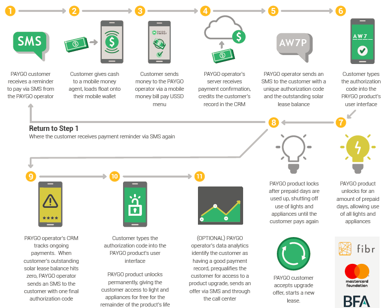

#### Project Title

# SFC PAYGo Solar Credit Repayment (Aug-2021)


## Problem Statement
Design an algorithm to help predict the next six months of payments for different customers which will allow PAYGo distributors to provide appropriate services and customer support, ensuring that they can continue to provide these important devices affordably and efficiently to the benefit of people all over Africa.

### Figure: PAYGO for customers step-by-step :

source : [Energypedia](https://energypedia.info/wiki/Pay-as-you-go_Approaches_(PAYGO))


## Project structure
├── data\
│   ├── metadata.csv\
│   ├── SampleSubmission.csv\
│   ├── Test.csv\
│   ├── Train.csv\
│   └── VariablesDefinition.txt\
├── images\
├── models\
├── main.ipynb\
├── submissions\
├── requirements.txt\
└── License

### Prerequisites

- GPU(s) with 16Gb RAM (e.g. Tesla V100)

```bash
pip install -r requirements.txt
```

### Summary
 
- EDA (Exploratory Data Analysis)
- Feature Engineering
- Hyper parameters optimisation using grid search
- Ensembling
- Standard Scaler
- Tensorflow
